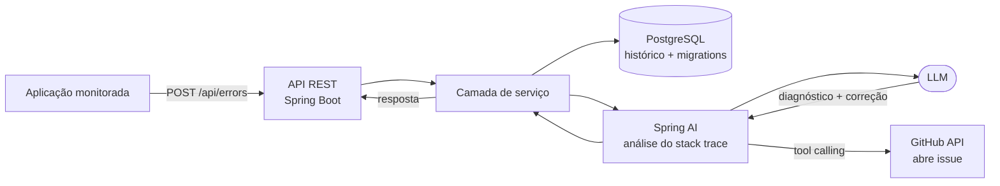
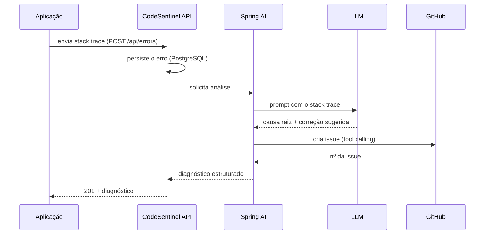

<div align="center">
# 🛡️ CodeSentinel

### Monitoramento de erros com IA — diagnostica *exceptions*, explica a causa e sugere a correção automaticamente.

[](https://openjdk.org/)
[](https://spring.io/projects/spring-boot)
[](https://spring.io/projects/spring-ai)
[](https://www.postgresql.org/)
[](https://www.docker.com/)
[](https://github.com/features/actions)
[]()

</div>
---

##  O que é

**CodeSentinel** é um serviço de observabilidade que recebe *logs* e *stack traces* de outras aplicações, usa um **LLM (via Spring AI)** para diagnosticar a causa raiz de cada erro em linguagem natural e, quando configurado, **abre uma issue automaticamente** com a análise e a correção sugerida.

A ideia nasceu de uma dor real: times pequenos gastam horas lendo *stack traces* repetidos. O CodeSentinel faz a primeira leitura por você.

>  **Projeto de estudo**, construído para aprofundar **Java + Spring AI + automação**. Não é um produto de produção.

---

## Funcionalidades

-  **Ingestão de erros via API REST** — outras aplicações enviam *logs* e *stack traces* por HTTP.
-  **Diagnóstico por IA** — o LLM analisa o *stack trace* e explica a causa provável em português claro.
-  **Sugestão de correção** — resposta estruturada com o trecho provável do problema e o caminho da solução.
-  **Abertura automática de issues** — via *tool calling* do Spring AI, o modelo cria a issue no repositório-alvo.
-  **Histórico persistente** — cada erro e diagnóstico fica salvo no PostgreSQL, com *migrations* versionadas.
-  **Ambiente 100% reproduzível** — sobe tudo com um `docker compose up`.
---

##  Arquitetura


 
---

##  Como funciona o diagnóstico


 
---

##  Stack

| Camada | Tecnologia |
|---|---|
| Linguagem | Java 17 |
| Framework | Spring Boot 3, Spring Web |
| IA | Spring AI (LLM, *tool calling*) |
| Persistência | Spring Data JPA + PostgreSQL |
| Migrations | Flyway |
| Testes | JUnit 5 + Testcontainers |
| Infra | Docker Compose |
| CI/CD | GitHub Actions |
 
---

##  Rodando localmente

**Pré-requisitos:** Docker e Docker Compose instalados.

```bash
# 1. Clone o repositório
git clone https://github.com/PietroRuotolo/codesentinel.git
cd codesentinel
 
# 2. Configure as variáveis de ambiente
cp .env.example .env
# edite o .env com sua chave de LLM e o token do GitHub
 
# 3. Suba a aplicação + banco
docker compose up --build
```

A API sobe em `http://localhost:8080`.
 
---

##  Exemplo de uso

Enviando um erro para diagnóstico:

```bash
curl -X POST http://localhost:8080/api/errors \
  -H "Content-Type: application/json" \
  -d '{
    "service": "checkout-service",
    "level": "ERROR",
    "stackTrace": "java.lang.NullPointerException: Cannot invoke \"Order.getTotal()\" because \"order\" is null\n\tat com.loja.CheckoutService.finalize(CheckoutService.java:42)"
  }'
```

Resposta:

```json
{
  "id": 128,
  "diagnosis": "O erro ocorre porque o objeto 'order' está nulo ao chamar getTotal(). Provável causa: o pedido não foi encontrado antes da finalização.",
  "suggestedFix": "Validar se 'order' não é nulo antes da linha 42, ou lançar uma exceção de negócio quando o pedido não existir.",
  "issueUrl": "https://github.com/PietroRuotolo/loja/issues/57"
}
```

> Substitua este exemplo pelos endpoints e respostas reais do seu projeto conforme ele evolui._
 
---

##  Testes

```bash
./mvnw test
```

Os testes de integração usam **Testcontainers** para subir um PostgreSQL real em container, garantindo que a persistência seja validada contra um banco de verdade — não um mock.

---

##  Autor

**Pietro Schimidt Ruotolo** — Estudante de Engenharia de Software (FIAP)

[](https://github.com/PietroRuotolo)
[](https://linkedin.com/in/pietro-ruotolo)
 
---

<div align="center">
<sub>Construído como estudo aprofundado de Java, Spring AI e automação. ⭐ Se achou interessante, deixe uma estrela!</sub>
</div>