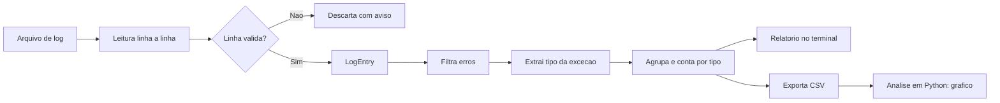
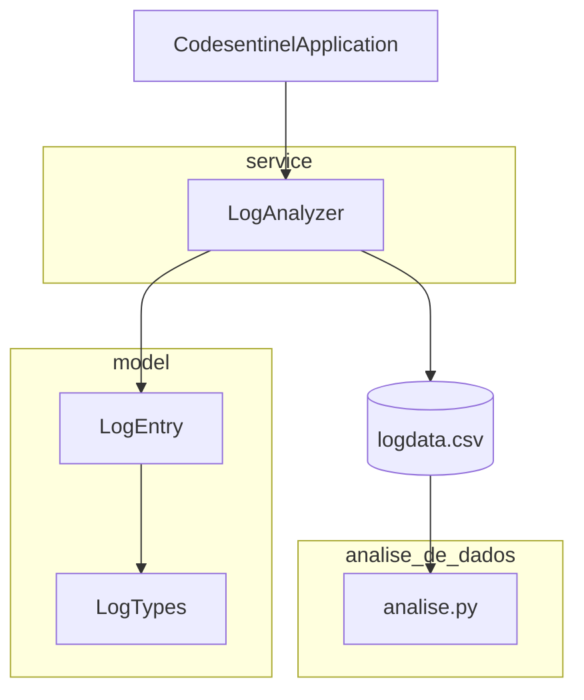

<div align="center">

# CodeSentinel

**Analisador de logs em Java que transforma o ruído de um arquivo de log em informação acionável.**


</div>

---

CodeSentinel lê um arquivo de log, separa o que é erro do que é apenas informação, extrai o tipo de cada exceção e produz um resumo do que mais falha no sistema — pronto para ser lido no terminal ou visualizado graficamente. Em vez de rolar centenas de linhas procurando o que quebrou, você recebe um retrato imediato de onde a aplicação mais sofre.

O projeto nasceu como um exercício de fundamentos de Java e vem sendo evoluído, de forma incremental, para uma aplicação web completa. Cada etapa foi construída priorizando decisões de design conscientes em vez de código que apenas funciona: modelagem de domínio, imutabilidade, validação defensiva e separação de responsabilidades são temas centrais do código, não detalhes acidentais.

---

## O problema que resolve

Um arquivo de log de produção é uma mistura densa de níveis (`ERRO`, `INFO`, `DEBUG`), mensagens e stack traces. Duas perguntas costumam importar quando algo dá errado: *quais* erros aconteceram e *com que frequência*. "Oito erros" pode ser oito problemas distintos ou o mesmo problema oito vezes — e a diferença muda completamente o diagnóstico.

O CodeSentinel responde a essas perguntas automaticamente: isola as entradas de erro, identifica o tipo de exceção de cada uma e agrupa as ocorrências por tipo, ordenando da mais frequente para a menos frequente.

---

## O pipeline de processamento



Cada etapa isola uma responsabilidade:

1. **Leitura** — o arquivo é lido linha a linha, com o recurso gerenciado por `try-with-resources`.
2. **Parsing e validação** — cada linha vira um `LogEntry` por um *factory method* que valida a estrutura e o nível; linhas malformadas são descartadas com aviso, sem interromper o processamento.
3. **Classificação** — as entradas de erro são separadas e o tipo da exceção é extraído com validação estrutural.
4. **Agregação** — as exceções são agrupadas e contadas por tipo.
5. **Apresentação** — o relatório é exibido ordenado por frequência e as estatísticas são exportadas em CSV.
6. **Análise de dados** — um script Python consome o CSV e gera a visualização das exceções mais recorrentes.

---

## Exemplo

Entrada:

```text
[ERRO] java.lang.NullPointerException: objeto Player nulo
[INFO] Serviço iniciado na porta 8080
[ERRO] java.lang.NullPointerException: cache não inicializado
[ERRO] java.lang.IllegalArgumentException: nível deve ser positivo
[DEBUG] Coleta de métricas concluída
```

Saída no terminal:

```text
------------------------------
LOG LIST — TYPE: [ERRO]
------------------------------
[ERRO] java.lang.NullPointerException: objeto Player nulo
[ERRO] java.lang.NullPointerException: cache não inicializado
[ERRO] java.lang.IllegalArgumentException: nível deve ser positivo
------------------------------
More Details:
NullPointerException : 2
IllegalArgumentException : 1
------------------------------
Foram identificados 3 erros em 5 linhas.
```

O CSV exportado alimenta um gráfico de barras das exceções mais frequentes, gerado em Python com Pandas e Matplotlib.

> Para exibir o gráfico aqui, adicione a imagem gerada ao repositório (por exemplo em `docs/grafico.png`) e referencie-a:
> ``

---

## Arquitetura



O código é organizado em pacotes por responsabilidade, seguindo a convenção de aplicações Spring:

```text
src/main/java/com/pietro/codesentinel/
├── CodesentinelApplication.java   Ponto de entrada da aplicação Spring Boot
├── model/
│   ├── LogEntry.java              Entrada de log (record imutável) e suas regras
│   └── LogTypes.java              Níveis de log válidos (enum) e parsing
└── service/
    └── LogAnalyzer.java           Coleção de logs, filtragem, agregação e exportação
```

| Componente | Papel |
|------------|-------|
| **`LogEntry`** | `record` imutável de uma entrada. Sabe responder sobre si mesmo (se é erro, qual o tipo de exceção) e é criado por um *factory method* que valida e devolve `Optional`. |
| **`LogTypes`** | `enum` dos níveis reconhecidos (`ERRO`, `INFO`, `DEBUG`), com parsing seguro que devolve `Optional` em vez de lançar exceção. |
| **`LogAnalyzer`** | Serviço de instância (sem estado global) que acumula logs, filtra erros, agrupa exceções por tipo e exporta o resultado. |

---

## Decisões de design

| Decisão | Por quê |
|---------|---------|
| **`Optional` em vez de `null`** | Torna o caso "sem valor" explícito na assinatura e elimina `NullPointerException` silenciosos. |
| **Validação na fronteira** | As entradas são validadas na criação; o restante do sistema confia que os objetos estão bem-formados. |
| **Imutabilidade via `record`** | Descarta bugs de estado compartilhado e comunica que uma entrada de log é um dado, não um objeto mutável. |
| **Comportamento junto do dado** | Perguntas sobre uma entrada são respondidas pela própria `LogEntry`, não por lógica espalhada. |
| **Separação de responsabilidades** | Ler, validar, agregar e apresentar são tarefas distintas, cada uma no seu lugar. |
| **Streams declarativos** | `groupingBy`, `counting` e `flatMap` sobre `Optional` expressam o *quê*, sem o ruído de laços manuais. |
| **CSV como fronteira entre linguagens** | Java escreve, Python lê; as duas partes concordam apenas sobre o formato — um contrato simples e portável. |

---

## Tecnologias

| Camada | Tecnologias |
|--------|-------------|
| **Backend** | Java 17+ (`record`, `enum` com comportamento, `Optional`, Streams/Collectors, generics, `try-with-resources`) |
| **Build** | Spring Boot com Maven (estrutura migrada, base para a evolução em API) |
| **Análise de dados** | Python, Pandas, Matplotlib |
| **Versionamento** | Git e GitHub, com Conventional Commits |

---

## Como executar

### Analisador em Java

Pré-requisito: JDK 17 ou superior. Com o projeto Maven configurado, execute pela IDE (rodando `CodesentinelApplication`) ou pela linha de comando com o Maven wrapper:

```bash
./mvnw spring-boot:run
```

O analisador processa um arquivo de log no formato:

```text
[ERRO] java.lang.NullPointerException: descrição do erro
[INFO] mensagem informativa
[DEBUG] mensagem de depuração
```

Ao processar, ele imprime o relatório no terminal e gera um arquivo `logdata.csv` com a contagem de exceções por tipo.

### Análise de dados em Python

Pré-requisitos: Python 3 com Pandas e Matplotlib.

```bash
pip install pandas matplotlib
python analise.py
```

O script lê o `logdata.csv` produzido pelo Java, ordena as exceções por frequência e exibe um gráfico de barras das mais recorrentes.

---

## Direção do projeto

O CodeSentinel é construído em etapas, e cada uma acrescenta uma camada real sobre a anterior. A base atual — parsing robusto, modelagem de domínio e análise de dados — é o alicerce sobre o qual as próximas capacidades se apoiam.

A migração para Spring Boot, já em curso, abre caminho para transformar o analisador em uma API REST: em vez de ler um arquivo e imprimir no terminal, o CodeSentinel passará a receber logs e responder com análises por HTTP. A partir daí, a intenção é dar-lhe memória, persistindo as entradas em um banco de dados relacional, e então fechar o ciclo que dá nome ao projeto — usar um modelo de linguagem para diagnosticar automaticamente as exceções e sugerir correções, tornando o "sentinela" capaz não só de contar erros, mas de explicá-los.

Cada capacidade será incorporada quando estiver de fato implementada. Este documento descreve o que o projeto é hoje; ele cresce junto com o código.

---

<div align="center">

**Pietro Ruotolo** — estudante de Engenharia de Software (FIAP), com foco em backend Java.

[](https://github.com/PietroRuotolo)
[](https://linkedin.com/in/pietro-ruotolo)

</div>
